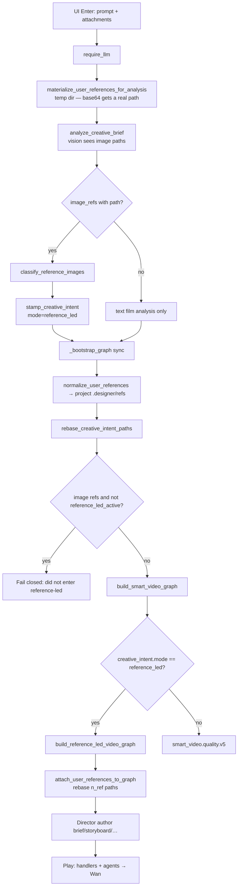
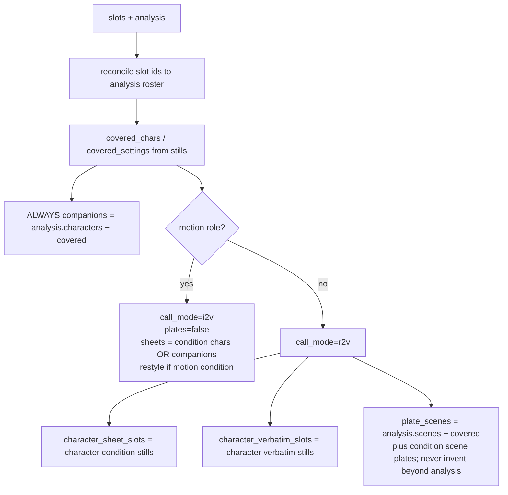
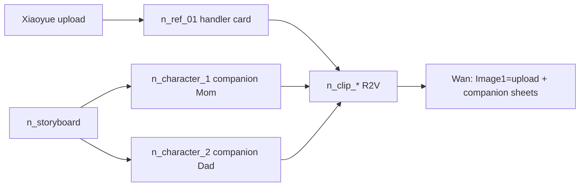
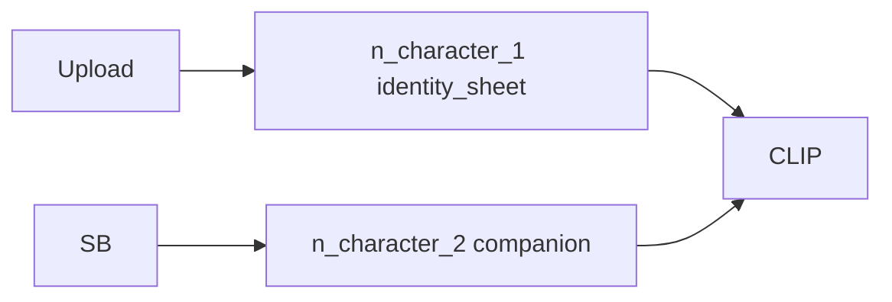
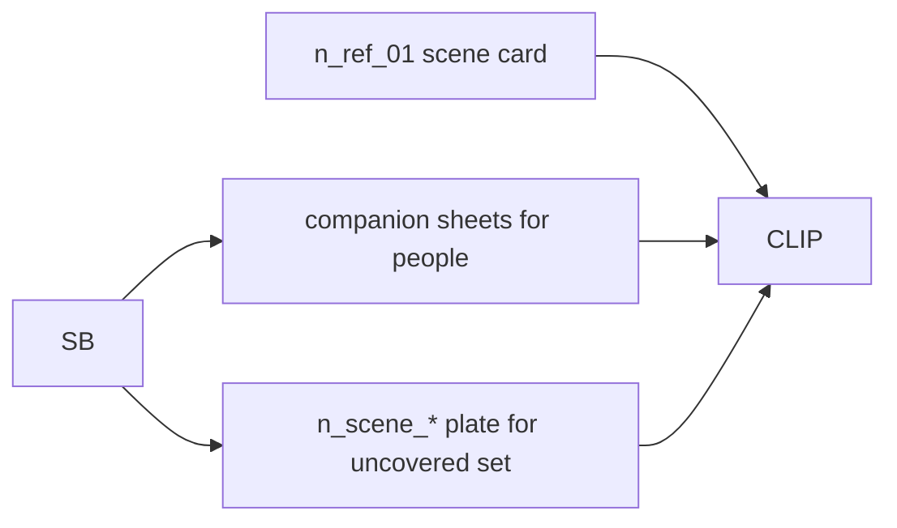
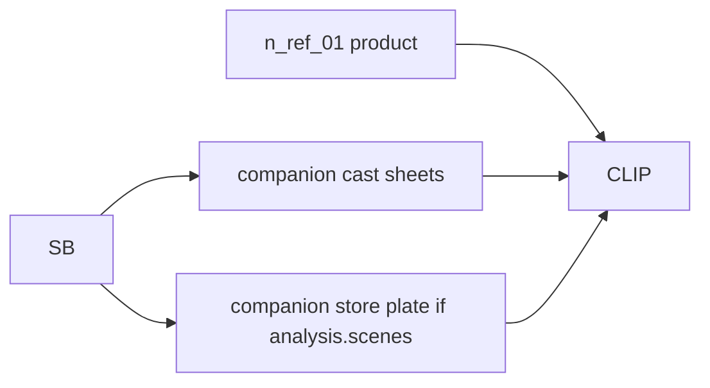
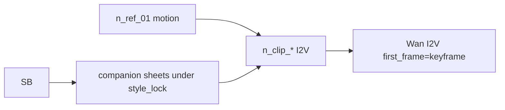

# Reference-Led Designer Pipeline — Full Specification (Reproduce Anywhere)

**Branch:** `0.2.8.beta1-referenceModeFix`  
**Repo root:** `jiuwenswarm/`  
**Primary modules:**

| Module | Path |
|---|---|
| Topology / plan | `jiuwenswarm/server/runtime/designer/pipeline/reference_led.py` |
| Uploads / classify | `jiuwenswarm/server/runtime/designer/user_references.py` |
| Enter bootstrap | `jiuwenswarm/server/runtime/gateway_adapter/designer_adapter.py` |
| Graph router | `jiuwenswarm/server/runtime/designer/smart_graph.py` |
| Brief LLM | `jiuwenswarm/server/runtime/designer/script_analysis.py` |
| Scenario tests | `tests/unit_tests/test_reference_led_scenarios.py` |

This document is the reproduce guide for the **complete** reference-led pipeline after:

1. Use-as-is defaults for all roles  
2. Base64 materialize-before-classify  
3. Companion cast/set generation under the authority still’s style  

---

## 1. User-facing contract

| Intent | Behavior |
|---|---|
| Still bound **verbatim** (default) | That subject is a **handler** card (`n_ref_*`). Pixels are never image-gen’d. |
| Still bound **condition** | That subject may be regenerated (`identity_sheet` / `medium_change` / scene plate). |
| Other people in `analysis.characters` **not covered** by a still | Generated as **companion** `n_character_*` sheets under the film `style_lock`. |
| Other places in `analysis.scenes` **not covered** | Companion `n_scene_*` plates for every **non-motion** job. Motion stays I2V (cast companions yes, set plates no). Never invent a room beyond analysis. |
| Solo / suppress flags | **Not topology.** Companions/plates exist only when analysis − covered stills is non-empty. Leftover `solo_subject` / `suppress_companions` / `keyframe_complete` JSON is ignored. |
| Multi-still | Up to **5** image stills. Each still covers a reconciled `character_id` / `setting_id`; only uncovered analysis entries become companions. |
| No phrase regex | Bindings come from LLM JSON only — never slogan keyword banks. |

---

## 2. End-to-end bootstrap (Enter)



### Critical Enter rules

1. **Never** use `normalize_user_references(..., dest_dir=None)` for classify — base64 would have `path=""` and skip stamp.  
2. Use `materialize_user_references_for_analysis` first.  
3. If `image_refs` non-empty and classify returns **no reads** → Enter hard-fails (`Attached stills could not be assigned a reference role`).  
4. After project materialize, `rebase_creative_intent_paths` so slots point at `.designer/refs`.  
5. Fail closed in `_bootstrap_graph` only when `reference_reads` exist but `creative_intent.mode != reference_led` (stamp lost). Classic attach without classify still allowed.  
6. Attachment limits: max 5 images, 1 video, 1 audio (`MAX_REFS_BY_KIND`).  

### Scenario kinds under test (`_SCENARIO_KINDS`)

`product`, `motion`, `scene`, `character`, `text`, `character_family`, `character_condition_family`, `product_cast`, `scene_cast`, `motion_cast`, `id_reconcile`, `five_stills` — **1000 cases each** (12 000 parametric) plus dedicated Fix tests. See `reference-mode-test-catalog.md`.

---

## 3. Roles, bindings, flags

### Roles

| Constant | Meaning |
|---|---|
| `character_identity` | Person who performs |
| `scene_source` | Place / set |
| `product_hero` | Product / prop |
| `still_motion_source` | Frame to animate (I2V) |
| `style_source` | Medium/palette authority only |

### Bindings (default = verbatim for all five)

| Binding | Meaning |
|---|---|
| `verbatim` | Use file as-is (handler card) |
| `condition` | Restyle / redraw / sheet / plate from still |

### Intent / slot flags

| Flag | Effect |
|---|---|
| `set_lock` | Scene geometry locked; never invent a plate that replaces it |
| `style_authority` | Film `style_lock` inherits still medium/look (or `match_reference_still`) |

---

## 4. `_job_plan` decision graph



### Coverage rules

- A character still (verbatim **or** condition) covers its reconciled `character_id` (analysis `id`, `name`, then `match_terms`; single-candidate fallback).  
- A scene still covers its `setting_id` the same way.  
- Motion with `character_id` covers that id; motion + single analysis character covers that solo subject.  
- Companions are **never invented** beyond `analysis.characters` / `analysis.scenes`.

---

## 5. Graph nodes

| Node | When | Delegate | Notes |
|---|---|---|---|
| `n_ref_*` | Every upload | **force_handler** | Immediate `output_ref`; card role when verbatim |
| `n_character_*` (condition) | Character `binding=condition` | built as handler; `apply_runtime_delegate` / `ensure_agents_and_prune` promotes to agent | `identity_sheet`, inputs include upload |
| `n_character_*` (companion) | Uncovered analysis cast | same promotion path | `companion_cast=True`, `require_reference_images=False`, style_lock |
| `n_restyle_01` | Motion `condition` | same promotion path | `medium_change` → I2V first frame |
| `n_scene_*` | Uncovered `analysis.scenes` on non-motion jobs | same promotion path | T2I under style_lock; never replaces locked upload |
| `n_brief` / `n_storyboard` | Always | agent | |
| `n_clip_*` | Always | agent at build | `compose_reference_clip_prompt` + `call_video_model` only |
| `n_compose` | Always | agent | Concat clips |

### Mode graphs

#### 5.1 Verbatim character + family (companions)



#### 5.2 Verbatim character solo


No companions when analysis lists only the covered id.

#### 5.3 Condition character + companions



#### 5.4 Scene verbatim + cast + extra setting



#### 5.5 Product + cast



#### 5.6 Motion + multi-cast



Cast companions mint for uncovered analysis characters. Motion jobs do **not** mint set plates.

---

## 6. `reference_image_plan` order

1. Product paths  
2. Verbatim character paths  
3. Character sheet node ids (condition + companions)  
4. Locked/verbatim scene paths  
5. Companion / restyle plate node ids  

Capped at 5 (`_cap_plan`): product and user upload paths first; generated companions/plates fill remaining slots; keep one generated scene last when it does not drop an upload. Truncated companions remain as canvas cards (clip inputs) even when they are not Wan refs.

---

## 7. Style inheritance

1. Brief `style_lock` from `ensure_style_lock`  
2. If any slot has `style_authority` or `set_lock`:  
   - vision `style_read.medium` → overwrite medium/look/palette  
   - else → `medium=match_reference_still`  
3. Companion sheet prompts use that film `style_lock` (`_companion_sheet_prompt`)

---

## 8. Reproduce checklist (engineer)

```bash
cd jiuwenswarm
git checkout 0.2.8.beta1-referenceModeFix
# editable install already assumed
.venv/Scripts/python.exe -m pytest tests/unit_tests/test_reference_led_scenarios.py -q --no-cov
```

**Manual Enter smoke**

1. Start: `.venv/Scripts/jiuwenswarm-start.exe` → http://localhost:5173  
2. Attach one character photo (base64 upload OK).  
3. Prompt: `make xiaoyue celebrate the new year with family exactly as she is in picture`  
4. Expect bootstrap `designer.graph.reference_led.v1`  
5. Expect `n_ref_01` character card + companion `n_character_*` for family (not regenerating Xiaoyue)  
6. Expect `creative_intent.mode=reference_led`, Xiaoyue binding `verbatim`

**Failure modes to watch**

| Symptom | Likely cause |
|---|---|
| `smart_video.quality.v5` | Classify/stamp skipped (path empty) |
| No family sheets | Analysis cast fully covered, or ids not reconciled (`xiaoyue` vs `char_1`) |
| Xiaoyue T2I sheet | Binding `condition` or covered id mismatch |
| Missing dining/kitchen plates | Analysis `scenes` empty — plates are never invented beyond analysis |

---

## 9. Files of record

| Doc | Purpose |
|---|---|
| This file | Full pipeline + reproduce |
| `reference-mode-full-pipeline-review.md` | Expert audit that this doc matches code |
| `reference-mode-test-catalog.md` | All scenario tests and what they assert |
| `reference-mode-as-is-pipeline.md` | Earlier as-is-only spec (superseded for companions) |

---

## 10. Residuals (known)

1. Wan/MiniMax remain generative — topology cannot freeze video pixels.  
2. Motion I2V still animates the keyframe; companion sheets are on graph/inputs but not R2V identity slots.  
3. Pure character jobs do not invent set plates from incidental `analysis.scenes`.  
4. Plan cap of 5 may truncate large casts — prioritize product/verbatim/companions policy if hit.
