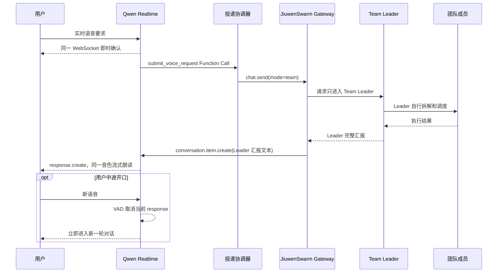

# Qwen-Audio 语音 Team Leader

该实验性 sidecar 只允许用户与 JiuwenSwarm Team Leader 对话。Qwen-Audio Realtime
持续接收麦克风语音，先即时确认，然后通过 Function Call 将结构化要求交给 Team Leader。
团队成员仍由 Leader 使用现有工具调度，语音入口不支持 `@成员` 直达。

Leader 的后续文字汇报不再调用独立 HTTP TTS。sidecar 将汇报作为文本注入同一个 Qwen
Realtime WebSocket，再用 `response.create` 触发当前会话音色朗读。用户在汇报期间直接开口，
`server_vad` 会打断服务端生成，客户端同时清空本地音频缓存。



## 安装和配置

macOS 先安装 PortAudio，再安装语音可选依赖：

```bash
brew install portaudio
pip install -e '.[voice]'
```

配置北京地域的百炼 API Key 和业务空间 ID：

```bash
export DASHSCOPE_API_KEY='你的百炼 API Key'
export DASHSCOPE_WORKSPACE_ID='你的百炼业务空间 ID'
```

## 运行

先正常启动 JiuwenSwarm Gateway，然后运行：

```bash
jiuwenswarm-voice \
  --session 'voice-leader-test' \
  --project-dir '/你的项目目录'
```

默认连接 `ws://127.0.0.1:19001/tui`。需要指定地址时使用：

```bash
jiuwenswarm-voice \
  --session 'voice-leader-test' \
  --gateway-url 'ws://127.0.0.1:19001/tui' \
  --project-dir '/你的项目目录'
```

`--voice` 同时控制即时确认和 Leader 汇报的 Realtime 音色。现在没有 `--tts-model`、
`--tts-voice` 或成员音色参数，也不需要 `dashscope` SDK。

## 工作规则

1. 用户音频以 16kHz、16bit、单声道 PCM 持续写入一个 Qwen WebSocket。
2. Qwen 对用户语音简短确认，然后调用 `submit_voice_request`。
3. sidecar 收到 `response.done` 后，使用 Gateway `chat.send` 把请求交给默认 Team Leader。
4. 成员的内部 `chat.final` 只显示在终端或网页，不进入语音；只有 Leader 的完整
   `chat.final` 会排队播报。
5. Leader 汇报通过 `conversation.item.create` 注入同一个 Realtime 上下文，并发送
   `response.create` 生成音频。队列按汇报到达顺序处理。
6. `server_vad` 或 `smart_turn` 检测到用户开口时会自动打断当前 Qwen response；客户端
   立即丢弃已缓存但尚未播放的 PCM，避免旧汇报继续响。
7. 被打断的 Leader 汇报不会触发 Function Call；新的用户语音照常形成新的 Leader 请求。

同一个 Function Call 的 `call_id` 只提交一次。用户打断语音入口的即时确认时，该轮被
取消的 Function Call 不会提交。超过 1200 字的 Leader 汇报只朗读前 1200 字并提示到终端
或网页查看详情。

## 网页只读镜像

网页只读镜像仍可绑定同一个 TUI 会话。打开网页会话，点击对话标题栏右侧的无线电图标，
填入与 `--session` 相同的会话 ID，再点击“开始镜像”。网页显示 Team Leader、成员和任务
事件，但不额外发送请求；语音输入继续由 sidecar 所在终端的麦克风完成。
